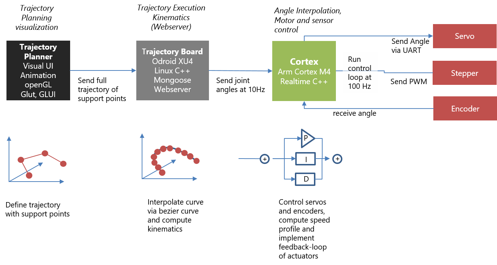
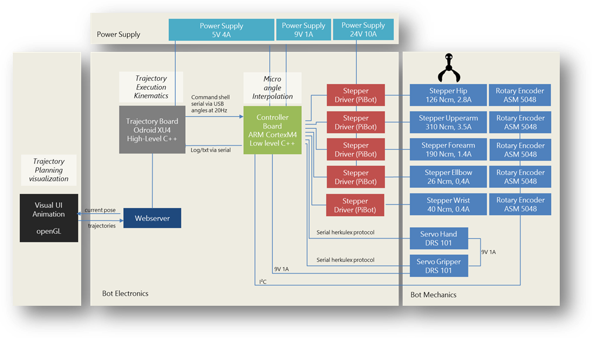

Since man built the first robot, he wanted it to look like himself. My goal was to make Walter look vintage. But, movements should be smooth, and – rather a matter of personal taste – I do not like visible humps or bulges with motors or gearboxes, nor horrible cables hanging everywhere. Reminds me too much of my dentist. All stuff should be inside the enclosure. 

After checking youtube, I recognized that just a few DIY robots are close to what I had in mind. There's the construction by Andreas Hölldorfer ([Printable Robot Arm](https://hackaday.io/project/3800-3d-printable-robot-arm)), which got covered recently ("Moveo"). Unfortunately without mentioning the obvious inspiration coming from Andreas. I got lots of ideas from his construction, and there are still a couple of parts directly derived from his design.

Another nice construction called [Thor](https://hackaday.io/project/12989-thor) is coming from Ángel Larrañaga Muro which has an interesting differential gearbox for the lower actuators.

This is what I had in mind. Most of the DIY robots are using servos, mostly for convenience, since the encoder is built-in already and they are easy to control. Thing is, when it comes to higher torque, the connection of the servo with the actuator becomes difficult, and hard to make of 3D printed material. If the servo or the flange moves just a little bit within the housing, the according play will magnify to a significant amount at the end of the actuator. An The required precision to avoid this is way above hobby grade components. 

And servos are boringly easy to use. No fun in construction. A motor with a belt drive and a separate angle sensor solves this, it provides low backlash and allows the electronics to compensate imprecise parts with the sensor placed separately from the motor. Additionally, the motor of an actuator can be placed in the previous joint, lowering the centre of gravity of each actuator.

When a belt drive is set, choice comes naturally to stepper motors, since an additional gearbox is not necessary anymore, torque is high and the belts should compensate the vibrations coming from the stepping nature of these motors.

Software is also not easy. Most robot makers stop as soon as limps move, what makes these robots look diy. Making the full stack up to trajectory planning means four months of work when you have weekends only, of which some parts were really difficult (inverse kinematics). The data flow of the full stack looks like this:

We have:
* [Trajectory Planner](./Trajectory) ([source code](https://github.com/jochenalt/Walter/tree/master/code/WalterPlanner))
This is a UI for planning trajectories. All animated gifs in this wiki are made with it. Trajectories are planned by defining single support. After planning is done, the trajectory is transfered to the

* [Trajectory Execution](./Webserver) ([source code](https://github.com/jochenalt/Walter/tree/master/code/WalterServer)). This component consists of a webserver that runs trajectories by interpolating Bézier curves betweeen support points, computing the inverse [Kinematics](https://github.com/jochenalt/Walter/wiki/Kinematics) per pose and sends the resulting series of angles to the 

* [Cortex](./Cortex) ([source code](https://github.com/jochenalt/Walter/tree/master/code/BotCortex)). This low level component takes interpolated poses and controls the actuators accordingly by applying control algorithms ([PID controller](https://en.wikipedia.org/wiki/PID_controller)). Servos are controlled directly by the cortex controller board  via a serial interface. Steppers do not have an internal feedback loop, so we need rotary encoders detecting the absolute angle of the joint and allowing to implement feedback controllers.

On the mechanical side, we have two actuators driven by a servo (mainly due to space restrictions) and four actuators driven by a stepper/rotary encoder combination. Details are shown in [Construction](./Construction).

Steppers are driven by retail stepper drivers (PiBot Stepper Driver) around the popular PWM stepper driver Toshiba 6600 (4.5A max). The stepper drivers are directly connected to the Cortex. It receives joint angles at 10Hz, interpolates the points in between, and sends the according PWM signal to the stepper drivers and to the servos. Besides micro interpolation of the trajectory, the controller board takes care of the speed profile, i.e. it limits the acceleration and speed of each actuator. The controller board is a DIY board around an ARM Cortex M4 (Teensy 3.5), running the control loop with 100 Hz. I started with an ATmega 644 8-bit controller, but it turned out that the ATmega was not able to control 5 steppers with a proper sample rate, let alone reading 5 encoders on top. 

The trajectory controller board is encapsulated by a webserver exposing the current movement and accepting commands like new trajectories.

